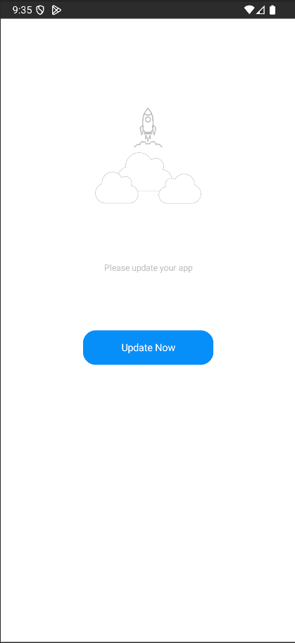
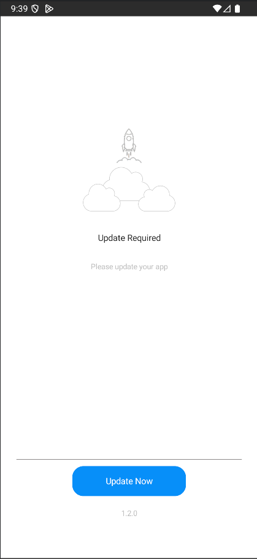
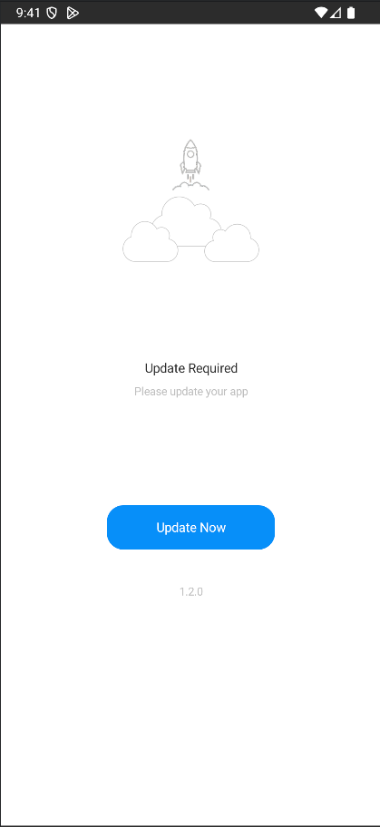
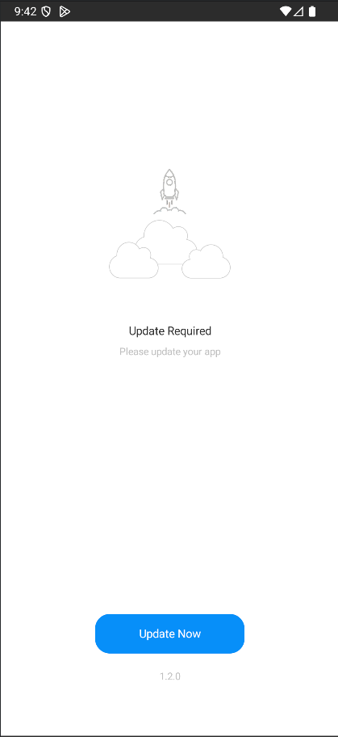
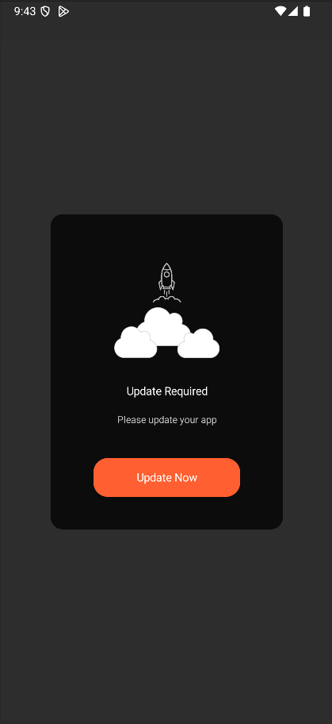
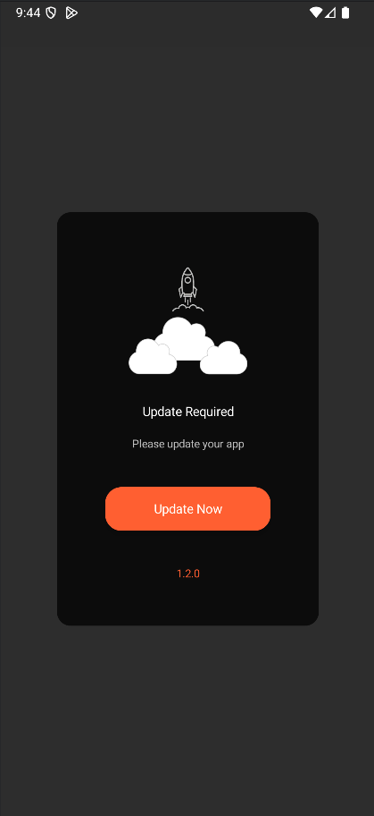

# ForceUpdateKit 📱

[](https://jitpack.io/#ControlKit/ForceUpdateKit-Android)
[](LICENSE)
[](https://android-arsenal.com/api?level=26)

A powerful and customizable Android library for managing force updates in your applications. Built with Jetpack Compose and modern Android architecture patterns.

## ✨ Features

- 🎨 **6 Beautiful UI Styles** - FullScreen and Popover variants
- 🌍 **Multi-language Support** - Localized content support
- 🔧 **Highly Customizable** - Customize every aspect of the UI
- 🏗️ **Modern Architecture** - MVVM with Repository pattern
- 🧪 **Well Tested** - Comprehensive unit and UI tests
- 📊 **Analytics Ready** - Built-in action tracking (VIEW, UPDATE)
- 🚀 **Easy Integration** - Simple setup with minimal code
- 💪 **Error Handling** - Robust error management with retry mechanisms

## 🍎 iOS Version

Looking for the iOS library? Visit the ForceUpdateKit (iOS) repository on GitHub: [ControlKit/ForceUpdateKit](https://github.com/ControlKit/ForceUpdateKit)

## 📦 Installation

Add the JitPack repository to your project's `build.gradle`:

```gradle
allprojects {
    repositories {
        maven { url 'https://jitpack.io' }
    }
}
```

Add the dependency to your app's `build.gradle`:

```gradle
dependencies {
    implementation 'com.github.ControlKit:ForceUpdateKit-Android:0.0.2'
}
```

## 🚀 Quick Start

### Basic Usage

```kotlin
import com.forceupdatekit.forceUpdateKitHost
import com.forceupdatekit.config.ForceUpdateServiceConfig
import com.forceupdatekit.view.config.ForceUpdateViewConfig
import com.forceupdatekit.view.config.ForceUpdateViewStyle

@Composable
fun MyApp() {
    val kit = forceUpdateKitHost(
        config = ForceUpdateServiceConfig(
            version = "1.0.0",
            appId = "your-app-id",
            deviceId = "unique-device-id",
            viewConfig = ForceUpdateViewConfig(
                forceUpdateViewStyle = ForceUpdateViewStyle.FullScreen1
            )
        ),
        onState = { state ->
            when (state) {
                is ForceUpdateState.ShowView -> {
                    // Update dialog is shown
                }
                is ForceUpdateState.NoUpdate -> {
                    // No update available
                }
                is ForceUpdateState.UpdateError -> {
                    // Error occurred
                }
            }
        }
    )
    
    // Trigger update check
    kit.showView()
}
```

## 🎨 UI Styles

ForceUpdateKit provides 6 different UI styles to match your app's design:

### FullScreen Styles

#### FullScreen1 - Clean & Minimal

- Full-screen overlay
- Large image at top
- Centered description
- Single update button

#### FullScreen2 - Detailed Layout

- Full-screen overlay
- Header title
- Detailed description
- Separator line
- Version information

#### FullScreen3 - Balanced Design

- Full-screen overlay
- Header and description sections
- Version info at bottom
- Balanced layout

#### FullScreen4 - Modern Layout

- Full-screen overlay
- Modern design elements
- Enhanced visual hierarchy

### Popover Styles

#### Popover1 - Compact Dialog

- Compact dialog overlay
- 90% screen width
- Rounded corners
- Perfect for non-intrusive updates

#### Popover2 - Enhanced Dialog

- Compact dialog with version info
- Enhanced layout
- Additional version details

## ⚙️ Configuration

### Service Configuration

```kotlin
ForceUpdateServiceConfig(
    // Required
    version = "1.0.0",                    // Current app version
    appId = "your-app-id",                // Unique app identifier
    deviceId = "device-id",               // Device identifier
    
    // Optional
    skipException = false,                // Skip errors silently
    timeOut = 5000L,                      // API timeout in milliseconds
    timeRetryThreadSleep = 1000L,         // Retry delay
    maxRetry = 5,                         // Maximum retry attempts
    canDismissRetryView = false,          // Allow dismissing retry view
    lang = "en"                           // Language code
)
```

### View Configuration

```kotlin
ForceUpdateViewConfig(
    // Style Selection
    forceUpdateViewStyle = ForceUpdateViewStyle.FullScreen1,
    
    // Image Configuration
    imageDrawble = R.drawable.update_icon,     // Custom image resource
    placeholderImageDrawble = R.drawable.placeholder,
    errorImageDrawble = R.drawable.error_icon,
    contentScaleImageDrawble = ContentScale.Fit,
    
    // Layout Modifiers
    popupViewLayoutModifier = Modifier.fillMaxSize(),
    popupViewBackGroundColor = Color.White,
    popupViewCornerRadius = 16.dp,
    
    // Text Content
    headerTitle = "Update Available",
    descriptionTitle = "A new version is available with exciting features!",
    buttonTitle = "Update Now",
    versionTitle = "Version 2.0.0 - December 2024",
    
    // Colors
    headerTitleColor = Color.Black,
    descriptionTitleColor = Color.Gray,
    buttonColor = Color.Blue,
    buttonCornerRadius = 12.dp,
    
    // Custom Views (Advanced)
    imageView = { imageUrl ->
        AsyncImage(
            model = imageUrl,
            contentDescription = "Update image"
        )
    },
    buttonView = { onClick ->
        Button(
            onClick = onClick,
            colors = ButtonDefaults.buttonColors(
                containerColor = MaterialTheme.colorScheme.primary
            )
        ) {
            Text("Custom Update Button")
        }
    }
)
```

## 🔧 Advanced Usage

### Custom Image Loading

```kotlin
ForceUpdateViewConfig(
    imageView = { imageUrl ->
        AsyncImage(
            model = imageUrl,
            contentDescription = "Update image",
            modifier = Modifier
                .size(200.dp)
                .clip(RoundedCornerShape(16.dp)),
            contentScale = ContentScale.Crop,
            placeholder = painterResource(R.drawable.placeholder),
            error = painterResource(R.drawable.error_icon)
        )
    }
)
```

### Custom Button Design

```kotlin
ForceUpdateViewConfig(
    buttonView = { onClick ->
        Row(
            modifier = Modifier.fillMaxWidth(),
            horizontalArrangement = Arrangement.spacedBy(16.dp)
        ) {
            OutlinedButton(
                onClick = { /* Handle cancel */ },
                modifier = Modifier.weight(1f)
            ) {
                Text("Later")
            }
            Button(
                onClick = onClick,
                modifier = Modifier.weight(1f),
                colors = ButtonDefaults.buttonColors(
                    containerColor = Color(0xFF4CAF50)
                )
            ) {
                Text("Update")
            }
        }
    }
)
```

### Custom Text Views

```kotlin
ForceUpdateViewConfig(
    headerTitleView = { title ->
        Text(
            text = title,
            style = MaterialTheme.typography.headlineMedium,
            color = MaterialTheme.colorScheme.primary,
            textAlign = TextAlign.Center
        )
    },
    descriptionTitleView = { description ->
        Text(
            text = description,
            style = MaterialTheme.typography.bodyLarge,
            color = MaterialTheme.colorScheme.onSurface,
            textAlign = TextAlign.Center,
            lineHeight = 24.sp
        )
    }
)
```

### Error Handling

```kotlin
val kit = forceUpdateKitHost(
    config = ForceUpdateServiceConfig(
        // ... your config
        skipException = false,  // Set to true to skip errors silently
        maxRetry = 3,          // Number of retry attempts
        timeRetryThreadSleep = 2000L  // Delay between retries
    ),
    onState = { state ->
        when (state) {
            is ForceUpdateState.ShowViewError -> {
                // Handle network or API errors
                Log.e("ForceUpdate", "Error: ${state.data?.message}")
            }
            is ForceUpdateState.SkipError -> {
                // Error was skipped (when skipException = true)
                Log.i("ForceUpdate", "Error skipped")
            }
            is ForceUpdateState.UpdateError -> {
                // Error during update action
                Log.e("ForceUpdate", "Update error: ${state.data?.message}")
            }
        }
    }
)
```

### Multi-language Support

```kotlin
ForceUpdateServiceConfig(
    // ... other config
    lang = "fa"  // Persian
    // lang = "ar"  // Arabic
    // lang = "en"  // English
)
```

## 📊 State Management

The library provides comprehensive state management through `ForceUpdateState`:

```kotlin
sealed class ForceUpdateState {
    object Initial                    // Initial state
    object NoUpdate                   // No update available
    object Update                     // Update action completed
    object SkipError                  // Error was skipped
    data class ShowView(val data: CheckUpdateResponse?)           // Show update dialog
    data class ShowViewError(val data: ApiError?)                 // Show error dialog
    data class UpdateError(val data: ApiError?)                   // Update action error
}
```

## 🔌 API Integration

The library integrates with your backend API. Example base URL: `https://example.com/api/force-updates`

- **Check Update**: `GET /force-updates`
- **Send Action**: `POST /force-updates/{id}`

### API Parameters

```kotlin
// Check Update Request
GET /force-updates
Headers:
  - x-app-id: {appId}
  - x-version: {version}
  - x-sdk-version: {sdkVersion}
  - x-device-uuid: {deviceId}

// Send Action Request
POST /force-updates/{id}
Headers:
  - x-app-id: {appId}
  - x-version: {version}
  - x-sdk-version: {sdkVersion}
  - x-device-uuid: {deviceId}
Body:
  - action: "VIEW" | "UPDATE"
```

### Response Format

```json
{
    "data": {
        "id": "update-id",
        "title": [
            {"language": "en", "content": "Update Available"},
            {"language": "fa", "content": "آپدیت موجود است"}
        ],
        "description": [
            {"language": "en", "content": "New features available"},
            {"language": "fa", "content": "ویژگی‌های جدید موجود است"}
        ],
        "force": true,
        "icon": "https://example.com/icon.png",
        "link": "https://play.google.com/store/apps/details?id=com.yourapp",
        "button_title": [
            {"language": "en", "content": "Update Now"},
            {"language": "fa", "content": "آپدیت کن"}
        ],
        "version": "2.0.0",
        "sdk_version": 2,
        "minimum_version": "1.0.0",
        "maximum_version": "3.0.0"
    }
}
```

## 🧪 Testing

The library includes comprehensive testing:

```kotlin
// Unit Tests
testImplementation 'junit:junit:4.13.2'
testImplementation 'io.mockk:mockk:1.14.5'
testImplementation 'app.cash.turbine:turbine:1.2.1'

// UI Tests
androidTestImplementation 'androidx.test.ext:junit:1.2.1'
androidTestImplementation 'androidx.test.espresso:espresso-core:3.6.1'
```

## 📱 Requirements

- **Minimum SDK**: 26 (Android 8.0)
- **Target SDK**: 36 (Android 14)
- **Kotlin**: 2.2.10+
- **Jetpack Compose**: 2025.08.00+

## 🔒 Permissions

Add to your `AndroidManifest.xml`:

```xml
<uses-permission android:name="android.permission.INTERNET" />
```

## 🎯 Best Practices

### 1. Version Management
```kotlin
// Use semantic versioning
version = "1.2.3"  // Major.Minor.Patch
```


### 3. Error Handling
```kotlin
// Always handle errors gracefully
onState = { state ->
    when (state) {
        is ForceUpdateState.ShowViewError -> {
            // Show user-friendly error message
            showErrorDialog("Unable to check for updates. Please try again later.")
        }
        // ... other states
    }
}
```

### 4. Customization
```kotlin
// Match your app's theme
ForceUpdateViewConfig(
    popupViewBackGroundColor = MaterialTheme.colorScheme.surface,
    buttonColor = MaterialTheme.colorScheme.primary,
    headerTitleColor = MaterialTheme.colorScheme.onSurface
)
```

## 🤝 Contributing

We welcome contributions! Please see our [Contributing Guidelines](CONTRIBUTING.md) for details.

## 📄 License

This project is licensed under the MIT License - see the [LICENSE](LICENSE) file for details.

## 🆘 Support

- 📧 Email: support@controlkit.com
- 🐛 Issues: [GitHub Issues](https://github.com/ControlKit/ForceUpdateKit-Android/issues)
- 📖 Documentation: [Wiki](https://github.com/ControlKit/ForceUpdateKit-Android/wiki)

## 🙏 Acknowledgments

- Built with ❤️ using Jetpack Compose
- Inspired by modern Android development practices
- Thanks to all contributors and the Android community

---

**Made with ❤️ by ControlKit Team**
